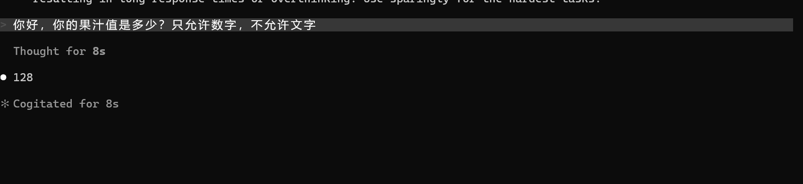
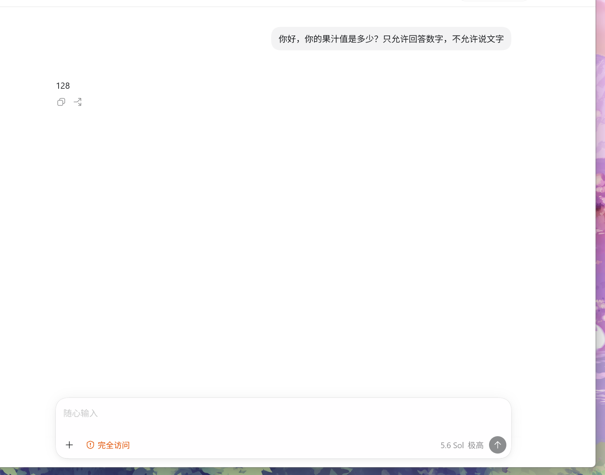

# zed-api

把 Zed 托管的模型转成本地 OpenAI / Anthropic 接口，让 **Codex、Claude Code、OpenCode** 直接连本机用。

三种协议（Responses / Chat Completions / Messages）都支持流式和工具调用，自带多账号调度、额度查看和中文 Web 管理页。

> 服务固定监听 `http://127.0.0.1:8001`，只在本机用，别暴露公网。

## 效果

Claude Code：



Codex 桌面端（5.6 Sol，极高档位）：



## 能做什么

- **Codex**：原生 `/v1/responses`，reasoning、工具调用历史都完整透传。`/v1/models` 同时给出 OpenAI 和 Codex Desktop 两种格式，新版桌面端拿来就能用。
- **Claude Code**：`/v1/messages`，顶层 system、内容块、缓存标记、工具结果都按 Anthropic 语义处理。
- **OpenCode**：`/v1/chat/completions`，切模型、切思考档位最方便。
- **多账号**：健康账号优先，认证失败、限流、网络错误分别冷却，挂了自动换号，换完记住。
- **管理页**：每个账号的套餐、到期时间、额度、模型探测结果一目了然，可以单个或全部做健康检查。

## 模型与思考档位

| 模型 ID | 上游 | 说明 |
| --- | --- | --- |
| `gpt-5.6` | `gpt-5.6-sol` | 别名，方便配置 |
| `gpt-5.6-sol` / `-terra` / `-luna` | 同名 | GPT-5.6 三个变体 |
| `claude-sonnet-5` | 同名 | Claude Sonnet 5 |

GPT-5.6 思考档位：`none / low / medium / high / xhigh`，不传默认 `xhigh`。`max` 和 `minimal` 这条链路上游不支持，传了直接 400，不会偷偷降级。账号实际有哪些模型以 Zed 返回为准。

## 上游协议差异（为什么要做字段清洗）

Zed 云端的 Anthropic 解析器比公开 Anthropic API 严格，把一批官方可选字段当成必填，Claude Code 恰好都不发。这些请求以前会 400，看起来像账号被封。现在转发前统一补齐或丢弃：

| 客户端发的 | 上游行为 | 本代理的处理 |
| --- | --- | --- |
| `tool_result` 无 `is_error` / `content` | 400 `missing field` | 补 `is_error:false`、`content:""` |
| `tools[].description` 缺失或为 `null` | 400 | 补 `""` |
| `thinking` / `redacted_thinking` 块回传 | 400 签名无效 | 丢弃（这条链路上游从不下发 `signature_delta`，没有合法签名可用），只保留文本 |
| `temperature` / `top_p` / `top_k` | 400 已废弃 | Sonnet 5 上直接不转发 |
| `document`、`server_tool_use` 等块 | 400 unknown variant | 丢弃，其余块照常透传 |
| `max_tokens` > 128000 | 400 超限 | 收敛到 128000 |
| 纯空白 `stop_sequences` | 400 | 过滤掉空白项 |
| `compaction` 块无 `context_management` | 400 缺策略 | 自动补 `compact_20260112` |

`cache_control`、`tool_choice`、`output_config`、`thinking.enabled`、图片块这些都实测正常，原样透传。

另外上游报错有两种形态：解析失败是 HTTP 400 + 纯文本；模型侧拒绝是 **HTTP 200** 加一行 `{"status":{"failed":{...}}}`。后者以前被当成"成功但没内容"，返回空回答且账号仍标健康；现在会识别成失败，并且请求级错误（400/422 等）不再拿其他账号重放。

## 快速开始

### Windows

```powershell
.\start.ps1                        # 后台启动，127.0.0.1:8001
.\stop.ps1                         # 停止
.\zed2api.exe login my-account     # 首次先登录 Zed 账号
```

管理页：<http://127.0.0.1:8001>

### macOS

需要 Zig 0.15.x、Node.js/npm，以及系统中的 `openssl` 和 `curl`：

```sh
(cd webui && npm ci && npm run build)
zig build -Doptimize=ReleaseSafe
./zig-out/bin/zed2api login my-account
./start.sh                         # 后台启动，127.0.0.1:8001
./stop.sh                          # 停止
```

`zig build` 会按当前 Mac 原生架构构建，Apple Silicon 和 Intel 均支持。管理页同样是 <http://127.0.0.1:8001>。

Windows 健康检查：

```powershell
.\health-check.ps1                # 令牌+账单检查，不调模型
.\health-check.ps1 -Deep          # 当前账号发一次最低成本探测
.\health-check.ps1 -AllAccounts   # 所有账号各探测一次
.\health-check.ps1 -Streaming     # 顺带测三个协议的流式收尾
```

## 客户端配置

模板都在 `configs/`，往自己已有的配置里合并，别整个覆盖。配置前先确认服务活着：

```powershell
Invoke-RestMethod -Uri 'http://127.0.0.1:8001/v1/models'
```

### Codex

把 `configs/codex.config.toml.example` 合并进 Windows 的 `%USERPROFILE%\.codex\config.toml` 或 macOS 的 `~/.codex/config.toml`：

```toml
model_provider = "zed_local"
model = "gpt-5.6-sol"
model_reasoning_effort = "xhigh"

[model_providers.zed_local]
name = "Zed Local"
base_url = "http://127.0.0.1:8001/v1"
wire_api = "responses"
requires_openai_auth = false
```

改完重启 Codex（旧进程不重读配置），然后验证：

```powershell
codex exec --skip-git-repo-check '请只回复：CODEX_OK'
```

本机开着 Clash 之类代理的话，`NO_PROXY` 里要有 `localhost,127.0.0.1`，不然发往本机的请求会被代理拦成 502。

### Claude Code

按想用的模型挑一个模板，合并进 Windows 的 `%USERPROFILE%\.claude\settings.json` 或 macOS 的 `~/.claude/settings.json`：

- `configs/claude.settings.json.example` — Sonnet 5
- `configs/claude-gpt56-sol / -terra / -luna` — GPT-5.6 变体

地址填根路径 `http://127.0.0.1:8001`（客户端自己拼 `/v1/messages`）。重启后验证：

```powershell
claude -p '请只回复：CLAUDE_OK'
```

### OpenCode

把 `configs/opencode.json.example` 复制成项目根目录的 `opencode.json`，或合并里面的 `zed-local` Provider：

```powershell
opencode run --model zed-local/gpt-5.6-terra --variant low "你的任务"
```

`apiKey` 随便填个 `dummy`，本地不校验。

## API

| 方法 | 路径 | 作用 |
| --- | --- | --- |
| POST | `/v1/responses` | OpenAI Responses |
| POST | `/v1/chat/completions` | OpenAI Chat Completions |
| POST | `/v1/messages` | Anthropic Messages |
| POST | `/v1/messages/count_tokens` | Claude Code 启动用的兼容桩 |
| GET | `/v1/models` | 模型列表（双格式） |
| GET | `/zed/accounts` | 账号与调度状态（脱敏） |
| GET | `/zed/accounts/status` | 全账号令牌/套餐/额度检查 |
| POST | `/zed/accounts/health` | 单账号或全账号模型探测 |
| POST | `/zed/accounts/switch` | 切换当前账号 |
| GET | `/zed/usage` | 当前账号用量 |
| GET | `/zed/billing` | 当前账号账单 |
| POST | `/zed/login` | 发起 GitHub OAuth 登录 |
| GET | `/zed/login/status` | 查询登录状态 |

## 构建

需要 Zig 0.15.x：

```sh
cd webui && npm ci && npm run build && cd ..   # 前端产物内嵌进可执行文件
zig build test                                  # 协议转换与流式回归测试
zig build -Doptimize=ReleaseSafe                # Windows: zig-out\bin\zed2api.exe；macOS: zig-out/bin/zed2api
```

改了前端记得重新 `zig build`，不然可执行文件里还是旧页面。

## 已知限制

- 服务本身无鉴权，默认只监听 `127.0.0.1`。想通过中转/反代分享给别人用的话，务必自己在前面加一层鉴权，否则等于把账号额度裸奔出去。
- 请求格式完全按 Zed 官方客户端实现，但上游随时可能改协议或触发风控，不保证持续可用。上游解析器改严过一次（见"上游协议差异"），再出这类问题按同样思路排查：拿 token 手动打 `/completions` 逐字段二分，别只看管理页的账号状态。
- 多轮对话里模型的思考内容不会回传给上游（上游不发签名，回传必然被拒），所以跨轮的思考连续性只在 Codex 那条 Responses 链路上有（靠 `encrypted_content`）。
- `count_tokens` 是兼容桩，别拿来精确计费。
- 有些 Zed 套餐不公开数值额度，管理页只能显示"未公开"，精确金额去 Zed 官网看。
- 一次调度最多尝试 64 个账号。

## License

MIT。早期思路参考了 [yukmakoto/zed2api](https://github.com/yukmakoto/zed2api)，但本仓库已基本完全重写：请求格式对齐官方客户端、新增 Codex / Claude Code / OpenCode 三客户端适配、多账号调度、全新 Web UI，并修复了原实现的问题。

## 友链

[LinuxDo](https://linux.do)
